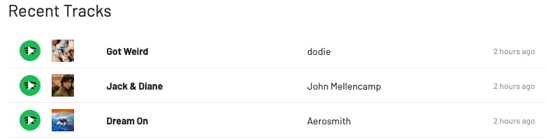

# Last.fm Spotify Play Buttons

Tampermonkey userscripts that connect Last.fm music discovery with Spotify playback.

Browse Last.fm charts, libraries, neighbors, recommendations, and artist pages, then launch tracks in Spotify with a single click — without manually copying song names into Spotify.



## How it works

Uses two Tampermonkey scripts:

### 1. Last.fm Spotify Play Button

Adds Spotify buttons to Last.fm pages.

When clicked:

```
Last.fm track
      ↓
Spotify search
```

### 2. Spotify Search Auto Play First Track

Runs on Spotify search pages.

It:

```
Spotify search page
      ↓
Find first track result
      ↓
Click Play
      ↓
Close helper tab
```

## Installation

#### Get Tampermonkey:

https://www.tampermonkey.net/

Make sure you give permission to run user scripts

#### Add BOTH scripts:

1. `lastfm-spotify-play-button.user.js`
2. `spotify-search-autoplay.user.js`

After installation, refresh Last.fm.

## Usage

1. Open any Last.fm track list:

   * charts
   * user libraries
   * recommendations
   * neighbors
   * artist pages

2. Click the green Spotify button.

3. Spotify will:

   * open a background search tab
   * select the first result
   * start playback
   * close the helper tab

## Disclaimer

This project is an unofficial community-created tool and is not affiliated with, endorsed by, or sponsored by Last.fm, Spotify, or any related company.

This project uses browser userscripts to automate actions in the websites you already use. It does not provide access to Spotify accounts, collect user data, or bypass any service restrictions.

Use this project at your own discretion. Website interfaces change over time, and updates to Last.fm or Spotify may cause the scripts to stop working.

You are responsible for complying with the terms and policies of the services you use.